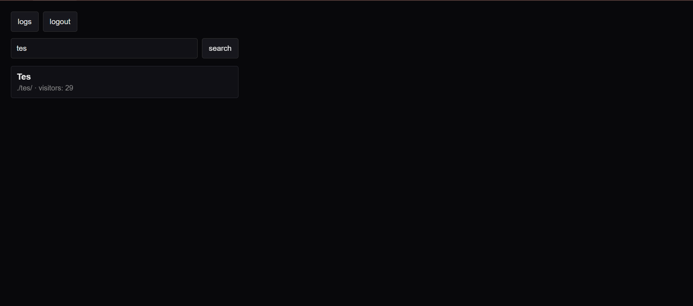
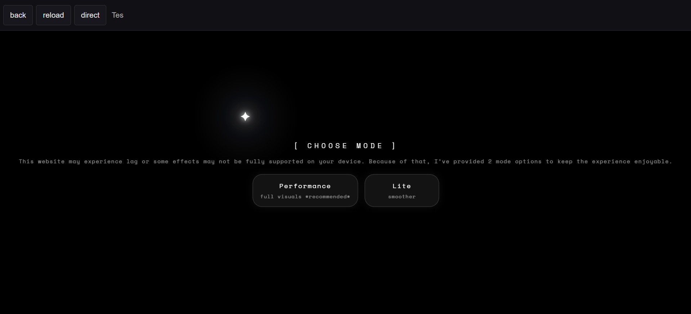

# Website Tester

## Description

Website Tester is a simple PHP-based dashboard for previewing multiple website projects from one place. It helps web developers **review a website’s overall structure, design, and functionality before deployment, allowing potential bugs to be identified and fixed more efficiently**.

## Preview
### Dashboard



### Project Preview



## Note
The screenshots above show a customized version of Website Tester that I modified for personal use. However, the core concept and functionality remain the same as described in this repository.

## Features

- Automatically scans project folders
- Search projects by name
- Preview website projects using an iframe
- Open projects directly in a new tab
- Simple and lightweight interface

## Technologies Used

- PHP
- HTML
- CSS
- JavaScript

## Requirements

- PHP 7.4 or newer
- A local server such as XAMPP, Laragon, or any PHP-supported hosting

## How to Use

1. Place your website project folders inside the main `website-tester` directory.
2. Make sure each project folder contains an `index.html` or `index.php` file.
3. Run the project using a local PHP server.
4. Open `index.php` in your browser.
5. Search and preview your website projects from the dashboard.

You can run it using PHP built-in server:

```bash
php -S localhost:8000
```

Then open:

```txt
http://localhost:8000
```

## Project Structure

```txt
website-tester/
├── index.php
├── README.md
├── assets/
│   ├── dashboard.png
│   └── project-preview.png
└── example-client/
    └── index.html
```

## Example Website Folder Structure

```txt
website-tester/
├── index.php
└── your-website-folder/
    ├── index.html
    ├── index.php
    ├── style.css
    └── script.js
```

## How It Works

Each website project is stored inside its own folder. If the folder contains an `index.html` or `index.php` file, it will automatically be detected and displayed in the dashboard.

Example:

```txt
example-client/
└── index.html
```

## Notes!

- This project does not automatically detect all website bugs.
- Testing is done manually through the preview dashboard.
- This project must be run on a local server or PHP-supported hosting because it uses PHP to scan project folders.
- Opening the file directly in the browser without a local server may not work properly.
- Some websites may not display perfectly inside an iframe, depending on their configuration.
